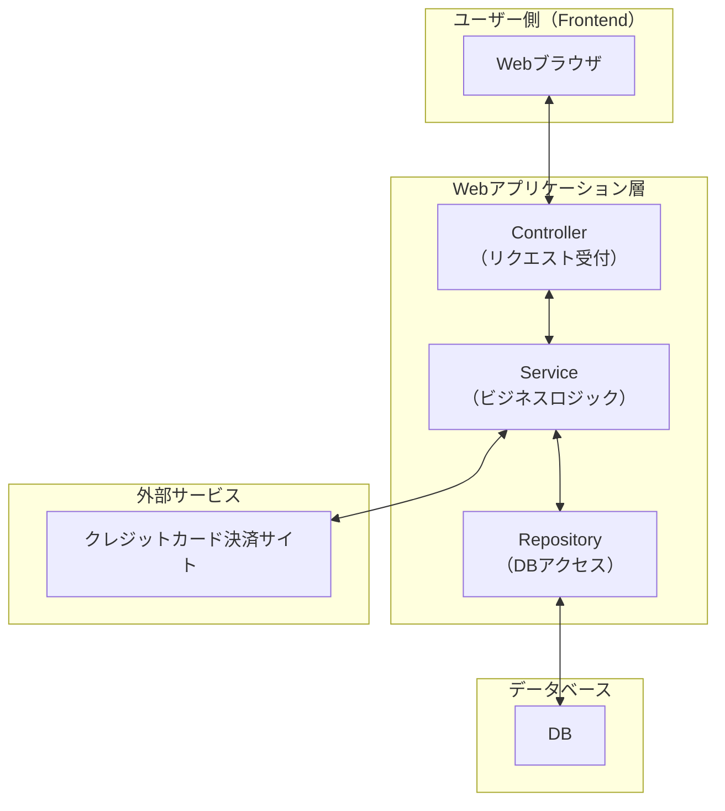

## システム概要

### システムの背景・目的
株式会社〇〇は、主に実店舗で雑貨（文房具、キッチン小物など）を販売しており、現在はSNSを通じた紹介・個別対応によって販売を行っているが、以下の課題を抱えている。

- 地域に限定された実店舗販売では、新規顧客の獲得が難しい
- 競合他社がECサイトを活用して成功しており、自社も販路拡大が必要
- SNS経由での問い合わせ増加により、対応工数が増大している

これらの課題を解決し、**オンライン上での購買体験を提供するためのECサイト（オンライン販売サイト）**を新たに構築する。

---

### システム仕様概要

| 項目             | 内容                                                                 |
|------------------|----------------------------------------------------------------------|
| **システム名**     | オンライン販売サイト（ECサイト）                                         |
| **対象ユーザー**   | 購入者、管理者                   |
| **提供サービス**   | - 商品閲覧 - カート機能 - 注文機能（非会員でも可）                         |
| **利用環境**     | スマートフォン・PC（レスポンシブ対応）                                        |
| **リリース目標**   | 2025年6月〜7月（夏前）                                                   |

### システム構成図
ユーザーのWebブラウザ（フロントエンド）がwebアプリケーション層を通じてデータベースと連携する、基本的な3層構造のWebシステムを表しています。

- #### ユーザー側
  Webブラウザ：ユーザーが操作する画面であり、ECサイトのUIが表示される。商品閲覧、カート操作、決済処理などを行う。
- #### webアプリケーション層
   **Controller**：HTTPリクエストを受け付け、レスポンスを返すエンドポイント。リクエストの内容を解析し、適切なServiceに処理を委譲する。

   **Service**：ビジネスロジックを担う層。注文処理、在庫管理、決済などのロジックを実行する。必要に応じてRepositoryや外部サービスを呼び出す。

   **Repository**：データベースへのアクセスを担当する層。データの取得、保存、更新などの処理を行う。

- #### データベース
  **DB**：商品情報、ユーザー情報、注文履歴などの永続化されたデータを保持。

- #### 外部サービス
   **クレジットカード決済サイト**：決済処理を安全に行うための外部システム。カード情報の認証・決済の実行を行う。

---

### 外部インターフェース

| 区分       | 接続対象             | 接続方式         | 備考                                           |
|------------|----------------------|------------------|-------------------------------------------------------|
| 外部サービス   | 決済サービス            | クレジットカード会社サイト |　外部システム（決済システム、在庫管理システム等）との連携は初回リリース時は対象外     |

## 非機能要件への対応方針

| 非機能区分 | 方針概要 |
|------------|----------|
| **セキュリティ** | - Webサイト全体でSSL/TLS証明書を導入し、通信はすべてHTTPSに統一 - 注文者の氏名、住所、電話番号、メールアドレスなど個人情報は暗号化されたデータベースに保存 - 個人情報の取り扱いはアクセス権限を厳格に管理し、不要な権限付与を避ける  |
| **拡張性** | - REST API構成 - 商品表示・注文処理など、機能ごとに設計をモジュール化 - バックエンドはMVC構造を持つフレームワークを利用 - フロントエンドはコンポーネントベースのフレームワークを使用 
| **パフォーマンス** | - 商品画像は事前にWeb最適化（圧縮・リサイズ） - サーバキャッシュ設定を活用（HTML・画像キャッシュ） - 表示速度目標：主要ページ2秒以内 - アクセス急増時にはCDN導入も視野に入れる |
| **可用性** | - クラウド環境を利用し、稼働率99.5%以上を目指す - バックアップは1日1回自動取得＋障害時復旧手順を整備予定 |

---

## 運用・保守設計の概要

| 区分 | 内容 |
|------|------|
| **商品管理** | 管理者がDBで、商品名・説明・画像・価格を手動登録・編集・削除できる |
| **注文処理** | 注文情報を一覧で確認可能 |
| **データバックアップ** | DBは日次自動バックアップ（クラウド側設定）、画像データは手動管理または定期同期 |
| **運用体制** | - 障害対応はメール＋即時対応体制（平日9:00〜18:00） - 定期メンテナンス（月1回）スケジュールを設定 |

### ログ設計方針

#### 出力ログの種類

| 種類           | 内容                                                                 |
|----------------|----------------------------------------------------------------------|
| アクセスログ   | Webサーバーで記録。日時、IP、メソッド、URL、ステータス、処理時間など。      |
| アプリログ     | システム処理、起動・停止、エラー、例外などを記録。必要に応じてデバッグ情報も含む。 |
| 操作ログ       | 管理者の操作記録。商品・在庫の変更、ログイン成功/失敗などを記録。              |

#### ログレベルと用途

| レベル  | 用途例                                      |
|--------|---------------------------------------------|
| INFO   | 通常処理の記録（例：注文成功、商品登録）       |
| WARN   | 軽微な異常（例：在庫数が不足している）         |
| ERROR  | 処理失敗、例外、システムエラー                 |
| DEBUG  | 調査用の詳細情報。通常は本番環境では無効         |

#### ログフォーマット例（項目）

| 項目             | 説明                                  |
|------------------|---------------------------------------|
| タイムスタンプ   | ログ出力日時（例：2025-07-02T10:00:00Z）|
| ログレベル       | INFO / WARN / ERROR / DEBUG           |
| メッセージ       | 処理内容やエラーの説明                 |
| ユーザーID       | 操作ユーザーの識別子（可能な場合）     |
| リクエストID     | トレーシング用のリクエスト識別子        |

#### 保管期間の方針

| ログ種別               | 保管期間      |
|------------------------|---------------|
| アクセスログ           | 最低1ヶ月以上 |
| アプリケーションログ   | 最低1ヶ月以上 |
| 操作ログ（監査ログ）   | 最低1年間以上 |

---

### 監視設計方針

#### 監視項目一覧

| カテゴリ           | 内容例                                                 |
|--------------------|--------------------------------------------------------|
| サーバーリソース   | CPU、メモリ、ディスク容量／I/O、ネットワーク使用率     |
| プロセス監視       | Web／アプリ／DBサーバープロセスの稼働確認             |
| サービス監視       | HTTP/HTTPS 応答確認（死活監視）                       |
| ログ監視           | ERRORログの検出・通知                                  |
| DB監視（オプション）| スロークエリや負荷状況の検知（将来的に拡張可）        |

#### 監視方法・通知手段

| 項目       | 内容                                                    |
|------------|---------------------------------------------------------|
| 使用ツール | Zabbix、Prometheus + Grafana、Datadog、クラウド監視機能など |
| 通知手段   | メール、Slack、Chatwork 等のチャット通知                  |
| 検知方法   | 閾値超過や異常パターン発生時に自動通知                    |

---