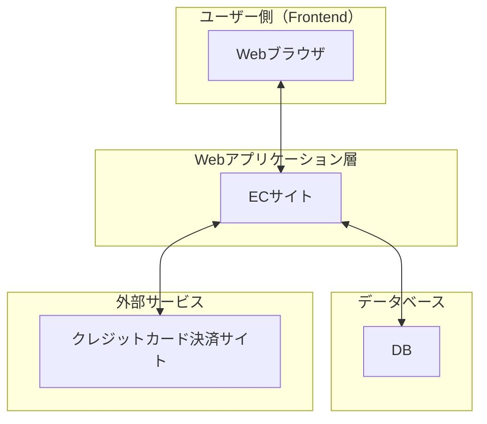
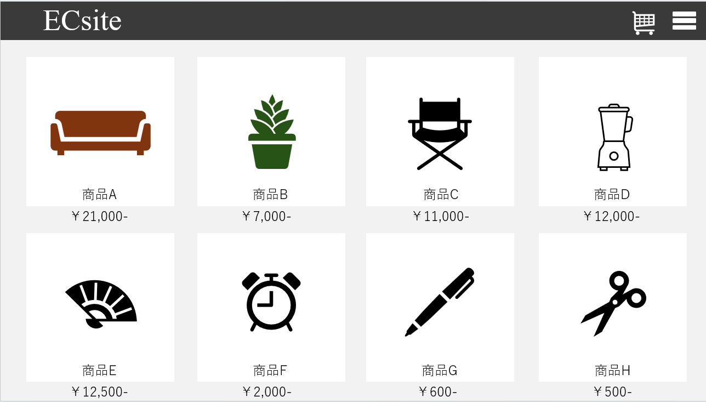
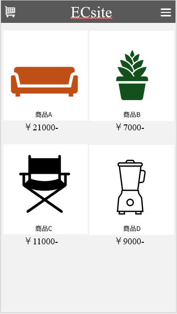
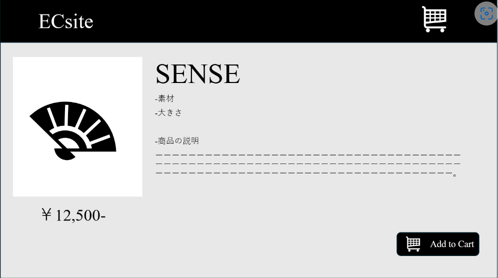
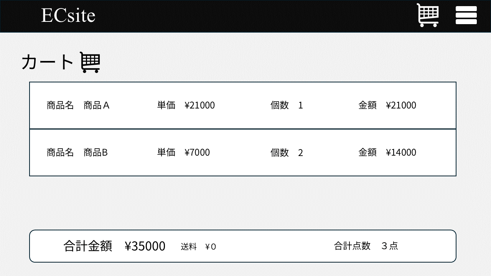

# オンライン販売サイト（ECサイト） 基本設計書

|項目  |内容|
| ------------------- | ------------------------------------- |
| ドキュメントバージョン | 1.0                                    |
| 作成日               | 2025年7月2日                           |
| 作成チーム           |Ace                               |
| 承認者               | 木山さん                             |

更新履歴 　ver.1.0            

---

## 1 はじめに

### 1.1 本書の目的

本書は、株式会社〇〇が開発を進める「オンライン販売サイト（ECサイト）」新規構築プロジェクトにおける基本設計の内容を定義するものである。要件定義書で定められた要件に基づき、システムの全体構成、主要な機能、画面、データ、非機能要件への対応方針などを明確にし、後続の詳細設計、実装、テスト工程のインプットとすることを目的とする。

### 1.2 プロジェクト概要
- 株式会社〇〇はこれまで実店舗を中心に雑貨（文房具、キッチン小物など）の販売を行ってきたが、販路は地域に限定されていた。  
- SNS（Instagram等）を活用して商品紹介や個別問い合わせ対応による販売も行っているが、受注処理や問い合わせ対応に手間がかかり、業務の効率性に課題がある。  
- 競合他社がオンライン販売チャネルを拡大しており、遠方の潜在顧客からも購買希望が寄せられている。

以上の課題を解決し、販路の拡大と受注業務を効率化することを目的とする。

### 1.3 前提知識

本書を読むにあたり、以下の知識を有していることを前提とする。

- 本プロジェクトの要件定義書の内容
- ECサイト開発の基本的な知識 (HTTP, HTML, CSS, JavaScript)
- REST API の基本的な概念
- Java および Spring Boot フレームワークの基本的な知識
- リレーショナルデータベースの基本的な知識

## 2 システム概要

### 2.1 システムの背景・目的
株式会社〇〇は、主に実店舗で雑貨（文房具、キッチン小物など）を販売しており、現在はSNSを通じた紹介・個別対応によって販売を行っているが、以下の課題を抱えている。

- 地域に限定された実店舗販売では、新規顧客の獲得が難しい
- 競合他社がECサイトを活用して成功しており、自社も販路拡大が必要
- SNS経由での問い合わせ増加により、対応工数が増大している

これらの課題を解決し、**オンライン上での購買体験を提供するためのECサイト（オンライン販売サイト）** を新たに構築する。

---

### 2.2 システム仕様概要

| 項目             | 内容                                                                 |
|------------------|----------------------------------------------------------------------|
| **システム名**     | オンライン販売サイト（ECサイト）                                         |
| **対象ユーザー**   | 購入者、管理者                   |
| **提供サービス**   | - 商品閲覧 - カート機能 - 注文機能（非会員でも可）                         |
| **利用環境**     | スマートフォン・PC（レスポンシブ対応）                                        |
| **リリース目標**   | 2025年6月〜7月（夏前）                                                   |

### 2.3 システム構成図

###　2.4  外部インターフェース

| 区分       | 接続対象             | 接続方式         | 備考                                           |
|------------|----------------------|------------------|------------------------------------------------|
| 外部サービス   | 決済サービス            | クレジットカード会社サイト |　             |

### 2.5 非機能要件への対応方針

| 非機能区分 | 方針概要 |
|------------|----------|
| **UI/UX** | - 白基調のシンプルなデザインをCSSで構成 - 画像サイズ・余白・フォントに一貫性を持たせ、視認性を高める - レスポンシブWebデザインによりスマホ対応を最優先 |
| **セキュリティ** | - Webサイト全体でSSL/TLS証明書を導入し、通信はすべてHTTPSに統一 - 注文者の氏名、住所、電話番号、メールアドレスなど個人情報は暗号化されたデータベースに保存 - 個人情報の取り扱いはアクセス権限を厳格に管理し、不要な権限付与を避ける  |
| **拡張性** | - REST API構成 - 商品表示・注文処理など、機能ごとに設計をモジュール化 - バックエンドはMVC構造を持つフレームワークを利用 - フロントエンドはコンポーネントベースのフレームワークを使用 
| **パフォーマンス** | - 商品画像は事前にWeb最適化（圧縮・リサイズ） - サーバキャッシュ設定を活用（HTML・画像キャッシュ） - 表示速度目標：主要ページ2秒以内 - アクセス急増時にはCDN導入も視野に入れる |
| **可用性** | - クラウド環境を利用し、稼働率99.5%以上を目指す - バックアップは1日1回自動取得＋障害時復旧手順を整備予定 |

---

### 2.6  運用・保守設計の概要

| 区分 | 内容 |
|------|------|
| **商品管理** | 管理者がDBで、商品名・説明・画像・価格を手動登録・編集・削除できる |
| **注文処理** | 注文情報を一覧で確認可能 |
| **データバックアップ** | DBは日次自動バックアップ（クラウド側設定）、画像データは手動管理または定期同期 |
| **運用体制** | - 障害対応はメール＋即時対応体制（平日9:00〜18:00） - 定期メンテナンス（月1回）スケジュールを設定 |

### 2.7 ログ設計方針

#### 2.7.1 出力ログの種類

| 種類           | 内容                                                                 |
|----------------|----------------------------------------------------------------------|
| アクセスログ   | Webサーバーで記録。日時、IP、メソッド、URL、ステータス、処理時間など。      |
| アプリログ     | システム処理、起動・停止、エラー、例外などを記録。必要に応じてデバッグ情報も含む。 |
| 操作ログ       | 管理者の操作記録。商品・在庫の変更、ログイン成功/失敗などを記録。              |

#### 2.7.2 ログレベルと用途

| レベル  | 用途例                                      |
|--------|---------------------------------------------|
| INFO   | 通常処理の記録（例：注文成功、商品登録）       |
| WARN   | 軽微な異常（例：在庫数が不足している）         |
| ERROR  | 処理失敗、例外、システムエラー                 |
| DEBUG  | 調査用の詳細情報。通常は本番環境では無効         |

#### 2.7.3 ログフォーマット例（項目）

| 項目             | 説明                                  |
|------------------|---------------------------------------|
| タイムスタンプ   | ログ出力日時（例：2025-07-02T10:00:00Z）|
| ログレベル       | INFO / WARN / ERROR / DEBUG           |
| メッセージ       | 処理内容やエラーの説明                 |
| ユーザーID       | 操作ユーザーの識別子（可能な場合）     |
| リクエストID     | トレーシング用のリクエスト識別子        |

#### 2.7.4 保管期間の方針

| ログ種別               | 保管期間      |
|------------------------|---------------|
| アクセスログ           | 最低1ヶ月以上 |
| アプリケーションログ   | 最低1ヶ月以上 |
| 操作ログ（監査ログ）   | 最低1年間以上 |

---

### 2.8 監視設計方針

#### 2.8.1 監視項目一覧

| カテゴリ           | 内容例                                                 |
|--------------------|--------------------------------------------------------|
| サーバーリソース   | CPU、メモリ、ディスク容量／I/O、ネットワーク使用率     |
| プロセス監視       | Web／アプリ／DBサーバープロセスの稼働確認             |
| サービス監視       | HTTP/HTTPS 応答確認（死活監視）                       |
| ログ監視           | ERRORログの検出・通知                                  |
| DB監視（オプション）| スロークエリや負荷状況の検知（将来的に拡張可）        |

#### 2.8.2 監視方法・通知手段

| 項目       | 内容                                                    |
|------------|---------------------------------------------------------|
| 使用ツール | Zabbix、Prometheus + Grafana、Datadog、クラウド監視機能など |
| 通知手段   | メール、Slack、Chatwork 等のチャット通知                  |
| 検知方法   | 閾値超過や異常パターン発生時に自動通知                    |

---

##　3 機能設計
###　3.1 機能一覧
#### 【商品閲覧機能群】
 
| 機能ID | 機能カテゴリ   | 機能詳細                                    | 入力データ         | 出力データ       | 備考                        | 優先度 |
|--------|----------------|------------------------------------------------|--------------------|------------------|-----------------------------|--------|
| 101    | 商品一覧表示   | - 商品のサムネイル画像     | 商品選択       | 商品一覧ページ   |                             | 高     |
| 102    | 商品一覧表示  | - 商品名                  | 商品選択            | 商品一覧ページ  |                             | 高     |
| 103    | 商品一覧表示   | - 価格表示                  | 商品選択            | 商品一覧ページ  |                             | 高     |
| 104    | 商品詳細表示   | - 大きな商品画像（複数枚対応）                | 商品ID             | 商品詳細ページ   | 商品の魅力を伝えるUI重視     | 高   |
| 105    | 商品詳細表示   | - 商品説明                   | 商品ID             | 商品詳細ページ   |                             | 高     |
 | 106    | 商品詳細表示   | - 素材                  | 商品ID             | 商品詳細ページ   |                             | 中     |
 | 107    | 商品詳細表示   | - 価格の表示                   | 商品ID             | 商品詳細ページ   |                             | 高     |
---
 
#### 【カート・注文機能群】
 
| 機能ID | 機能カテゴリ   | 機能詳細                                    | 入力データ           | 出力データ             | 備考                    | 優先度 |
|--------|----------------|---------------------------------------------|----------------------|------------------------|-------------------------|--------|
| 201    | カート機能     | - 商品のカート追加                           | 商品選択             | カート内容表示         |                         | 高     |
| 202    | カート機能     | - カート内商品の数量変更                      | 商品選択、数量       | カート内容表示         |                         | 高     |
| 203    | カート機能     | - カートから商品の削除                         | 商品選択             | カート内容表示         |                         | 高     |
| 204    | カート機能     | - 合計金額の計算表示                          | カート内容           | カート内容表示         | 注文金額が5000円以上の場合送料無料、5000円未満の場合一律500円                        | 高     |
| 205    | 注文機能       | - 購入者情報入力（氏名、住所、メール等）      | カート情報、配送先情報 | 注文確認画面           | 非会員購入対応           | 高     |
| 206    | 注文機能       | - 注文確認画面の表示                          | カート情報、購入者情報 | 注文確認画面           |                         | 高     |
| 207    | 注文機能       | - 注文確定処理                               | 注文確認承認         | 注文受付完了画面       |                         | 高     |
 
---
 
#### 【会員登録機能群】
 
| 機能ID | 機能カテゴリ   | 機能詳細                                    | 入力データ                   | 出力データ           | 備考                    | 優先度 |
|--------|----------------|---------------------------------------------|------------------------------|----------------------|-------------------------|--------|
| 301    | 会員登録機能   | - 会員任意登録                             | ユーザ情報（名前、メール、パスワード等） | 会員登録完了画面    | 非会員購入も可能                  | 高     |
| 302  | 認証機能  | -ログイン機能                             | 登録メールアドレス、パスワード | 会員登録情報   |                 | 高     |

 
---
 
#### 【スマホ対応機能群】
 
| 機能ID | 機能カテゴリ   | 機能詳細                                    | 入力データ           | 出力データ           | 備考                    | 優先度 |
|--------|----------------|---------------------------------------------|----------------------|----------------------|-------------------------|--------|
| 401    | スマホ対応     | - スマートフォン・タブレット対応のレスポンシブデザイン | 画面サイズ           | レスポンシブUI       | iOS・Android主要ブラウザ対応 | 高     |
| 402    | スマホ対応     | - タッチ操作に適したボタンサイズとレイアウト設計   | 画面サイズ           | タッチ操作対応UI     |                         | 高     |
---

### 3.2 機能構成図

graph LR
    ECサイト[株式会社〇〇 オンライン販売サイト]
 
    %% 大分類
    ECサイト --> F1[商品閲覧機能群]
    ECサイト --> F2[カート・注文機能群]
    ECサイト --> F3[会員登録・認証機能群]
    ECサイト --> F4[スマホ対応機能群]
 
    %% 商品閲覧機能
    F1 --> F1_1[商品一覧表示]
    F1 --> F1_2[商品詳細表示]
 
    %% 商品一覧表示の子機能
    F1_1 --> F1_1_1[サムネイル画像表示]
    F1_1 --> F1_1_2[商品名表示]
    F1_1 --> F1_1_3[価格表示]
 
    %% 商品詳細表示の子機能
    F1_2 --> F1_2_1[大きな商品画像表示]
    F1_2 --> F1_2_2[商品説明表示]
    F1_2 --> F1_2_3[素材情報表示]
    F1_2 --> F1_2_4[価格の再表示]
 
    %% カート・注文機能群
    F2 --> F2_1[カート機能]
    F2 --> F2_2[注文機能]
 
    F2_1 --> F2_1_1[商品追加]
    F2_1 --> F2_1_2[数量変更]
    F2_1 --> F2_1_3[削除]
    F2_1 --> F2_1_4[合計金額計算]
 
    F2_2 --> F2_2_1[購入者情報入力（非会員）]
    F2_2 --> F2_2_2[注文確認画面]
    F2_2 --> F2_2_3[注文確定]
 
    %% 会員登録
    F3 --> F3_1[会員任意登録]
    F3_1 --> F3_1_1[基本情報登録]
    F3_1 --> F3_1_2[登録完了/エラー画面表示]
    F3 --> F3_2[認証]

    %% スマホ対応機能群
    F4 -->F4_1[レスポンシブデザイン]
    F4 -->F4_2[タッチ操作に適したボタンサイズ・レイアウト設計]
 
 　　

### 3.3 主要機能フロー
#### 3.3.1 商品購入フロー

sequenceDiagram
    participant ユーザー
    participant 商品一覧・詳細
    participant カート
    participant 購入
    participant 注文

    ユーザー->>商品一覧・詳細: 商品一覧を表示要求
    商品一覧・詳細-->>ユーザー: 商品一覧を表示

    ユーザー->>商品一覧・詳細: 商品詳細を表示要求
    商品一覧・詳細-->>ユーザー: 商品詳細を表示

    ユーザー->>カート: 商品をカートに追加
    カート-->>ユーザー: カートに追加完了

    ユーザー->>カート: 購入手続きへ進む
    カート-->>ユーザー: ログインしますか？

    alt ログインする
        ユーザー->>カート: ログイン情報を入力
        カート-->>ユーザー: ログイン成功（個人情報自動入力）
    else ログインしない
        ユーザー->>カート: 購入者情報を手動入力
    end

    ユーザー->>購入: 決済情報入力・確認
    購入-->>ユーザー: 決済完了

    購入->>注文: 注文処理依頼
    注文-->>購入: 注文受付完了

    注文-->>ユーザー: 注文完了通知

#### 3.3.2 新規会員登録フロー

sequenceDiagram
    participant ユーザー
    participant 会員登録画面
    participant 登録システム

    ユーザー->>会員登録画面: 会員登録画面を開く
    会員登録画面-->>ユーザー: 入力フォームを表示

    ユーザー->>会員登録画面: ユーザー情報を入力して送信
    会員登録画面->>登録システム: 入力情報を送信・バリデーション
    alt 入力に不備あり
        登録システム-->>会員登録画面: エラー情報を返す
        会員登録画面-->>ユーザー: エラーメッセージ表示
    else 入力が有効
        登録システム-->>ユーザー: 登録完了メッセージ
    end

## 4 画面設計

### 4.1 画面一覧
| 画面ID | 画面名                 | 概要                                                                 | 機能ID        | 備考                         |
|--------|------------------------|----------------------------------------------------------------------|---------------|------------------------------|
| S001   | 商品一覧画面           | 商品の一覧を表示し、詳細画面への遷移が可能                          | 101/102/103   | 絞り込み・検索機能あり       |
| S002   | 商品詳細画面           | 選択した商品の詳細情報を表示                                        | 104/105/106/107 | カート追加ボタンあり         |
| S003   | カート画面             | カートに追加した商品の確認・数量変更が可能                          | 201/202/203/204 | 商品削除・合計金額表示       |
| S004   | ログイン画面           | 購入時に会員ログイン情報の入力を行う画面                            | 302             | -                            |
| S005   | ログイン完了画面       | ログイン完了後に遷移する画面                                        | 302             | -                            |
| S006   | ログインエラー画面     | ログインに失敗した場合に表示する画面                                | 302             | -                            |
| S007   | 購入者情報入力画面     | ログインをしないユーザーが注文のための購入者情報を入力する画面     | 205           | バリデーションあり           |
| S008   | 注文確認画面           | 入力内容及び注文内容の最終確認を行う画面                            | 206             | -                            |
| S009   | クレジット会社ページ遷移画面 | クレジット情報を入力する外部サイトに遷移する画面              | -             | -                            |
| S010   | 決済完了画面           | 決済完了後に戻ってくる画面                                          | -             | -                            |
| S011   | 注文完了画面           | 注文完了メッセージを表示する画面                                    | 207             | -                            |
| S012   | 会員登録画面           | 会員情報の入力および登録を行う画面                                  | 301           | -               |
| S013   | 会員登録完了画面       | 会員登録の完了メッセージを表示する画面                              | 301           | -               |
| S014   | 会員登録エラー画面     | 会員登録処理中にエラーが発生した場合に表示する画面                  | 301           | -              |

---
### 4.2 画面遷移図

graph TD
  S001[商品一覧画面] -->|商品クリック| S002[商品詳細画面]
  S001 -->|カートをクリック| S003[カート画面]
  S001 -->|会員登録| S012[会員登録画面]
  S002 -->|カートに入れる| S003
  S003 -->|買い物を続ける| S001
  S003 -->|ログインする| S004[ログイン画面]
  S003 -->|購入手続き（ログインしない）| S007[購入者情報入力画面]
  S004 -->|ログイン完了| S005[ログイン完了画面]
  S004 -->|ログイン失敗| S006[ログインエラー画面]
  S005 -->|次へ| S008[注文確認画面]
  S006 -->|カートに戻る| S003
  S007 -->|次へ| S008
  S008 -->|注文確定| S009[クレジット会社ページ遷移画面]
  S009 -->|自動遷移| S010[決済完了画面]
  S010 -->|次へ| S011[注文完了画面]
  S011 -->|トップページへ| S001
  S012 -->|登録成功| S013[会員登録完了画面]
  S012 -->|登録失敗| S014[会員登録エラー画面]
  S013 -->|トップページへ| S001
  S014 -->|トップページへ| S001

### 4.3 UI/UX基本方針
  | 項目           | 内容                                             |
| ------------ | ---------------------------------------------- |
| **全体トーン**    | シンプルでミニマル。白を基調とし、商品写真が主役となるデザイン。               |
| **色使い**      | 主に白・黒・グレーを基調に、一部アクセントカラーを使用       |
| **余白の活用**    | コンテンツ密度を抑え、視認性・可読性を高める。写真やテキストの余白を十分に取る。       |
| **フォント**     | Times New Roman、Noto Sans、16px以上推奨。 |
| **レスポンシブ対応** | PC／タブレット／スマートフォンに最適化されたレスポンシブデザインを採用。          |

| 項目                 | 内容                                           |
| ------------------ | -------------------------------------------- |
| **メニュー構成**         | 「商品一覧」「カート」など、明確なナビを上部に配置。 |
| **ハンバーガーメニュー（SP）** | スマートフォンではハンバーガーメニューを採用し、指操作しやすいレイアウトに。       |
          

| 項目         | 内容                                         |
| ---------- | ------------------------------------------ |
| **一覧ページ**  | 商品画像・商品名・価格を明確に表示。ホバー時の視覚的変化（例：画像切り替え）も検討。 |
| **詳細ページ**  | 複数の画像切り替え、大きな写真、簡潔な説明、素材・価格情報を順序良く配置。      |
| **カートボタン** | 固定表示。              |

| 項目             | 内容                                          |
| -------------- | ------------------------------------------- |
| **購入ステップの最適化** | 最小限の入力ステップで購入可能（非会員でも購入可）。ステップ表示で進捗を明示。     |
| **入力補助**       | プレースホルダ・自動入力（autocomplete）・郵便番号検索など入力負荷を軽減。 |
| **フォームのエラー表示** | 項目下に明確なエラーメッセージを表示。色＋テキストで伝える。              |

| 項目              | 内容                                   |
| --------------- | ------------------------------------ |
| **指で操作しやすいサイズ** | ボタンやリンクのタップエリアは44px以上。押し間違いを防ぐレイアウト。 |
| **縦スクロール最適化**   | 情報は縦に流れる構成とする。          |
| **固定ボタン導入**     | カートボタンや「購入へ進む」などは常に見える位置に配置（追従UI）。   |

### 4.4 主要画面のワイヤーフレーム
#### 4.4.1 メイン画面(パソコン)のワイヤーフレーム

#### 4.4.2 メイン画面(スマートフォン)のワイヤーフレーム

#### 4.4.3 商品詳細画面(パソコン)のワイヤーフレーム

#### 4.4.4 カート画面のワイヤーフレーム

## 5 データ設計

### 5.1 データ概念設計(ER図)

erDiagram
    CUSTOMER ||--o{ ORDER : has
    ORDER ||--o{ ORDER_ITEM : contains
    PRODUCT ||--o{ ORDER_ITEM : included_in
    PRODUCT ||--o{ CART_ITEM : has
    CART ||--o{ CART_ITEM : contains
    CUSTOMER ||--o| CART : has_one
    PRODUCT ||--o{ PRODUCT_IMAGE : has

    CUSTOMER {
        string customer_id PK "顧客ID（会員登録者）"
        string customer_name "氏名"
        string email "メールアドレス"
        string password "パスワード（ハッシュ化）"
        string shipping_address "配送先住所"
        string phone_number "電話番号"
        datetime created_at "登録日時"
        datetime updated_at "更新日時"
    }

    PRODUCT {
        string product_id PK "商品ID"
        string product_name "商品名"
        text description "商品説明"
        text material "素材"
        decimal price "価格"
        integer stock_quantity "在庫数"
        datetime created_at "登録日時"
        datetime updated_at "更新日時"
    }

    PRODUCT_IMAGE {
        string image_id PK "画像ID"
        string product_id FK "商品ID"
        string image_url "画像URL"
        int display_order "表示順序"
        boolean is_main "メイン画像フラグ"
    }

    ORDER {
        string order_id PK "注文ID"
        string customer_id FK "顧客ID（会員の場合）"
        string guest_name "購入者氏名（非会員の場合）"
        string guest_email "購入者メールアドレス（非会員の場合）"
        string guest_shipping_address "配送先住所（非会員の場合）"
        string guest_phone_number "電話番号（非会員の場合）"
        decimal total_amount "合計金額"
        string shipping_fee "送料"
        datetime order_date "注文日時"
        string order_status "注文ステータス"
    }

    ORDER_ITEM {
        string order_item_id PK "注文明細ID"
        string order_id FK "注文ID"
        string product_id FK "商品ID"
        int quantity "数量"
        decimal item_price "商品単価（注文時の価格）"
    }

    CART {
        string cart_id PK "カートID"
        string customer_id FK "顧客ID（会員の場合）"
        datetime created_at "作成日時"
        datetime updated_at "更新日時"
    }

    CART_ITEM {
        string cart_item_id PK "カート明細ID"
        string cart_id FK "カートID"
        string product_id FK "商品ID"
        int quantity "数量"
    }

### 5.2 主要テーブル概要

#### 5.2.1 CUSTOMERテーブル

- 会員登録を行った顧客の情報を管理する。
- customer_idをPKとする。
- 顧客のパスワードはハッシュ化して保存する。
- 顧客のメールアドレスはログインIDとして使用する。

#### 5.2.2 PRODUCTテーブル

- 販売する商品の情報を管理する。
- product_idをPKとする。

#### 5.2.3 PRODUCT_IMAGEテーブル

- 各商品に関連付けられた複数の画像情報を管理する。
- image_idをPK、product_idをFKとする。

#### 5.2.4 ORDERテーブル

- ユーザーからの注文情報を管理します。会員・非会員どちらの注文も記録する。
- order_idをPK、customer_idをFKとする。

#### 5.2.5 ORDER_ITEMテーブル

- 各注文に含まれる個々の商品の詳細（注文明細）を管理しする。
- order_item_idをPK、order_id・product_idをFKとする。

#### 5.2.6 CARTテーブル

- 会員ユーザーのカート情報を管理します。非会員の場合はセッションなどで一時的に管理する。
- cart_idをPKとし、customer_idをFKとする。
  

#### 5.2.7 CART_ITEMテーブル
- カート内の商品の詳細を管理する。
- cart_item_idをPK、cart_id・product_idをFkとする。
  

### 5.3 データフロー概要

#### 5.3.1 会員登録処理
- 画面（SC0101：会員登録画面）
ユーザーが氏名（customer_name）、メールアドレス（email）、パスワード（password）、配送先住所（shipping_address）、電話番号（phone_number）を入力し、「登録」ボタンをクリックする。
- アプリケーション
受け取った入力値に対して、次の処理を行う：
メールアドレス（email）の重複チェック
パスワード（password）の形式チェックとハッシュ化
現在日時を created_at、updated_at に設定
INSERT処理のためのデータ整形
- データベース
CUSTOMER テーブルに対して以下のデータをINSERTする：
customer_id（UUIDなどで生成）
customer_name
email
password（ハッシュ化済み）
shipping_address
phone_number
created_at
updated_at

#### 5.3.2 商品登録処理（在庫加算対応）
- データベース
管理者がPRODUCT テーブルにINSERT（新規商品）またはUPDATE（既存商品の在庫追加）
既存商品の在庫追加はproduct_name により既存商品と重複があるかをチェックし、重複があった場合にPRODUCT.stock_quantity に在庫数を加算する。
product_id
product_name
description
material
price
stock_quantity（在庫加算済）
created_at（INSERT時）
updated_at
管理者がPRODUCT_IMAGE テーブルに画像情報をINSERT（必要に応じて）
image_id
product_id
image_url
display_order
is_main

#### 5.3.3 カート操作処理（商品追加・数量更新）
- 画面（SC0301：商品詳細画面）
ユーザーが購入希望商品の数量（quantity）を指定し、「カートに追加」ボタンをクリックする。
- アプリケーション
ユーザーの customer_id に紐づく CART を検索
存在しない場合は cart_id を生成し、新規に CART を作成
CART_ITEM テーブルで該当 product_id の明細が存在するか確認
存在する場合：quantity を加算して更新
存在しない場合：新規に明細をINSERT
- データベース
CART テーブル：
cart_id
customer_id
created_at（新規作成時）
updated_at（都度更新）
CART_ITEM テーブル：
cart_item_id
cart_id
product_id
quantity（加算または新規数値）
#### 5.3.4 注文確定処理
- 画面（SC0302：注文確認画面）
ユーザーが注文内容を確認後、配送先や連絡先（会員は CUSTOMER.shipping_address、非会員は画面入力）を入力し、「注文を確定」ボタンをクリックする。
- アプリケーション
CART_ITEM テーブルから該当 cart_id の全商品を取得
各 product_id について PRODUCT.price を参照
quantity × price で各商品の小計を計算し、合計金額（total_amount）を算出
ORDER テーブルに注文情報をINSERT
会員の場合：customer_id を指定
非会員の場合：guest_name、guest_email、guest_shipping_address、guest_phone_number を保存
ORDER_ITEM テーブルに各商品をINSERT
order_id、product_id、quantity、item_price
注文完了後、CART_ITEM のレコードを削除または無効化
- データベース
ORDER テーブル：
order_id
customer_id またはゲスト情報
total_amount
shipping_fee
order_date
order_status
ORDER_ITEM テーブル：
order_item_id
order_id
product_id
quantity
item_price
CART_ITEM テーブル：
対象 cart_id に該当するレコードを削除（または更新）

## 6 用語集

| 用語                 | 説明                                                                                                                              |
| :------------------- | :-------------------------------------------------------------------------------------------------------------------------------- |
| **SSL/TLS** | Web通信の暗号化を実現するプロトコル。TLSはSSLの後継で、HTTPS通信の基盤。中間者攻撃や盗聴を防ぎます。                                      |
| **HTTPS** | HTTP over SSL/TLS。HTTPに暗号化を加えた安全な通信方式。ユーザーとサーバー間の情報を保護します。                                             |
| **レスポンシブWebデザイン** | デバイス（PC／スマートフォン／タブレット）に応じてレイアウトやUIを最適化する設計手法。モバイルファーストの思想とも親和性が高いです。 |
| **REST API** | リソースをHTTPの標準メソッド（GET/POST/PUT/DELETE）で操作するWeb API設計方式。疎結合・可読性・拡張性に優れます。                         |
| **MVC** | Model-View-Controllerの略。アプリケーション構造を「データ処理」「表示」「制御」に分離し、保守性を向上させる設計パターンです。             |
| **コンポーネントベース** | UIを再利用可能な部品（コンポーネント）単位で設計・構築するフロントエンド開発手法。ReactやVue.jsで主流です。                       |
| **キャッシュ** | 頻繁にアクセスされるデータ（HTML、画像、APIレスポンスなど）を一時保存し、レスポンス高速化やサーバ負荷削減を実現します。                   |
| **CDN (Content Delivery Network)** | 静的コンテンツを地理的に分散したサーバーから配信し、通信遅延の低減やアクセス集中の緩和を図る仕組みです。                                 |
| **稼働率（可用性）** | システムが正常に稼働している時間の割合。例：99.5%は年間で約44時間以内のダウンタイムに相当します。                                     |
| **スロークエリ** | 実行に時間がかかるSQLクエリのこと。パフォーマンスボトルネックの要因となるため、監視・最適化が必要です。                                   |
| **監査ログ（操作ログ）** | 管理者・ユーザーの操作履歴を記録するログ。情報改ざん検知や内部不正防止の証跡として利用されます。                                   |
| **アプリケーションログ** | システム動作中の状態（処理・エラー・起動／終了など）を記録するログ。トラブル時の原因分析に不可欠です。                             |
| **アクセスログ** | Webサーバーへのリクエストを記録するログ。IPアドレス、メソッド、URL、レスポンスコードなどを含みます。                                   |
| **ログレベル（INFO / WARN / ERROR / DEBUG）** | ログ出力の深刻度や分類。INFO：正常処理、WARN：注意、ERROR：障害、DEBUG：詳細な技術情報を示します。 |
| **リクエストID** | 各リクエストごとに割り当てられる一意の識別子。ログ間の関連づけやトレーシングに活用されます。                                        |
| **トレーシング** | アプリケーション内でのリクエストや処理の流れを追跡すること。障害解析や性能調査で活用されます。                                          |
| **死活監視** | サービスやサーバーの生死状態（正常稼働しているか）を定期確認し、異常があればアラートを発する監視手法です。                                 |
| **Prometheus + Grafana** | Prometheus は時系列メトリクス収集ツール、Grafana はその可視化ダッシュボード。合わせて使うことで監視・分析が可能です。                  |
| **Zabbix** | OSSベースの統合監視システム。リソース監視、死活監視、アラート通知、グラフ化などに対応します。                                              |
| **Datadog** | SaaS型のモニタリングツール。インフラからアプリケーションレベルまでの包括的な監視と分析が可能です。                                        |
| **バックアップポリシー** | システムデータの保護方針。自動／手動バックアップ、頻度、保持期間、復旧手順などを含みます。                                          |
| **ログ保管期間** | 各種ログの保存期間を定めたルール。法令遵守や監査対応のため、操作ログは長期間保存されることが多いです。                                   |
| **UUID** | ユニークなIDを生成するための標準規格。`customer_id` などに使用され、重複が起きにくいです。                                               |
| **PK（Primary Key）** | 主キー。各テーブルでレコードを一意に識別するためのカラム。例：`customer_id`、`product_id`。                                        |
| **FK（Foreign Key）** | 外部キー。他のテーブルの主キーを参照するカラム。テーブル間のリレーションを構成します。                                                |
| **ハッシュ化** | パスワードなどの機密情報を暗号学的に変換して保存する処理。元に戻せない不可逆的変換です。                                                  |
| **ログインID** | 顧客認証に用いる一意の識別情報。ここでは `email` をログインIDとして使用します。                                                      |
| **created\_at** | レコードが新規作成された日時を記録するカラム。監査や時系列管理に利用します。                                                            |
| **updated\_at** | レコードが最後に更新された日時を記録するカラム。変更履歴の管理に使用されます。                                                          |
| **INSERT処理** | データベースに新しいレコードを追加する操作。SQLの基本操作の1つです。                                                                  |
| **重複チェック** | 既存データと同じ値があるか確認する処理。主に一意制約付きのカラム（例：`email`）に対して行います。                                   |
| **在庫加算** | 既存商品の `stock_quantity` に数量を加算する処理。新規登録との分岐が必要となります。                                                    |
| **明細テーブル** | 注文やカートなどで複数の商品を管理するための子テーブル。例：`CART_ITEM`、`ORDER_ITEM`。                                               |
| **display\_order** | 商品画像などの表示順序を示す数値。数値が小さいほど優先的に表示されます。                                                            |
| **is\_main** | 商品画像がメイン画像かどうかを示すフラグ。例：1 = メイン画像、0 = サブ画像。                                                              |
| **JOIN** | SQLで複数のテーブルを結合し、関連データを取得する操作。外部キーを基に行われます。                                                          |
| **order\_status** | 注文の状態を管理するカラム。例：未発送、発送済み、キャンセルなどの状態を保持します。                                                  |
| **item\_price** | 注文時点での商品の単価を記録するカラム。価格変動の影響を受けないように保持されます。                                                  |
| **total\_amount** | 注文全体の合計金額（送料含まず）を計算し記録するカラム。                                                                          |
| **shipping\_fee** | 注文に対する送料。商品合計金額とは別に管理されます。                                                                              |
| **無効化** | レコードを物理削除せず、論理的に無効とする処理。フラグで非表示状態にしたり、利用停止とする設計です。                                        |
| **cart\_id** | ユーザーのカートを一意に識別するID。会員・非会員ともに使用され、一時的に保持されます。                                                  |
| **一時的に管理** | 会員以外のユーザーデータをセッションやクッキーで一時保存する設計。ログイン不要の操作に用います。                                        |
| **関連付けられた画像** | 商品と1対多で紐づく画像情報。`PRODUCT_IMAGE` テーブルで管理され、複数画像に対応可能です。                                          |
| **注文明細** | 注文に含まれる各商品の情報。数量、価格などの詳細を `ORDER_ITEM` テーブルで管理します。                                                    |
| **order\_id** | 注文情報の主キー。1件の注文を一意に識別するためのID。会員・非会員どちらにも対応します。                                                  |
| **order\_item\_id** | 注文内の商品明細の主キー。1つの注文に対して複数の商品が紐づく場合に用いられます。                                                     |
| **ミニマルデザイン** | 最小限の要素で構成されたデザインアプローチ。装飾を排除し、ユーザーの注意を目的の操作やコンテンツに集中させます。                        |
| **ハンバーガーメニュー** | モバイルUIで主に使用される三本線アイコンのナビゲーション。限られた画面領域を有効活用するためのUIパターンです。                        |
| **ホバー効果（ホバーインタラクション）** | カーソルを要素上に置いた際に視覚的な変化を加える表現。ECでは画像切り替えや影、拡大などでUX向上を図ります。                          |
| **ステップUI（ステップインジケーター）** | 多段階の入力フローにおける現在地や残りのステップを可視化するUI要素。進捗把握・離脱防止に効果があります。                            |
| **オートコンプリート** | ユーザーの入力に対して候補を自動補完する仕組み。入力負荷の軽減や誤入力防止に有効です。                                                  |
| **追従UI（ステッキーボタン）** | スクロールしても常に表示され続けるボタンやナビゲーション。主に「カート追加」「購入へ進む」など重要アクションで使用されます。            |