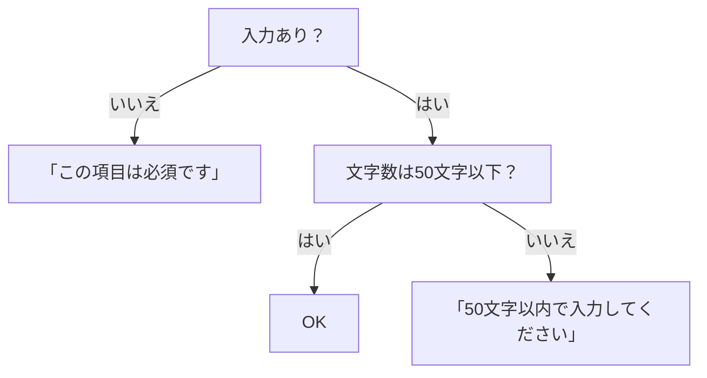
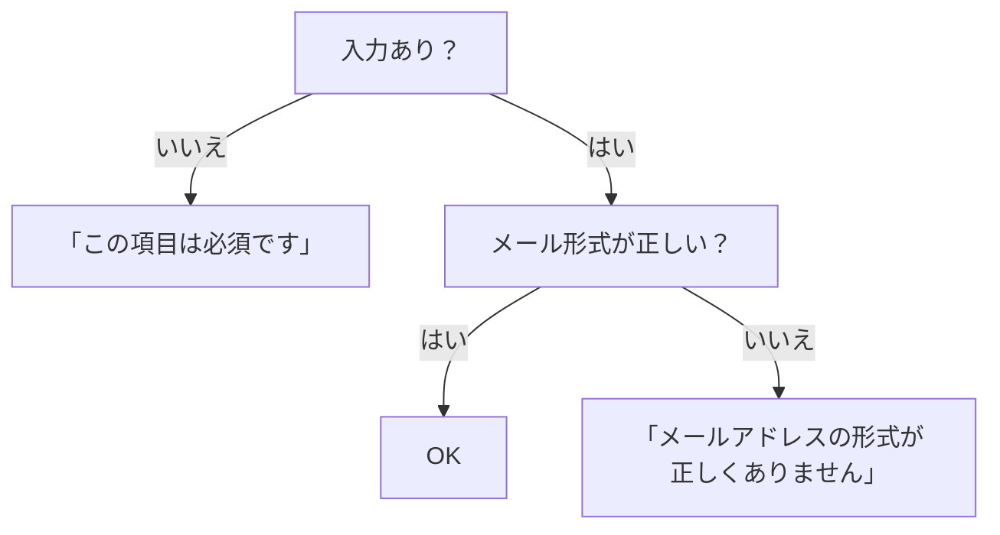
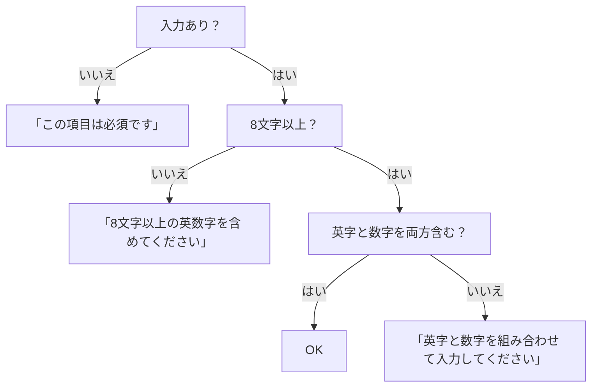
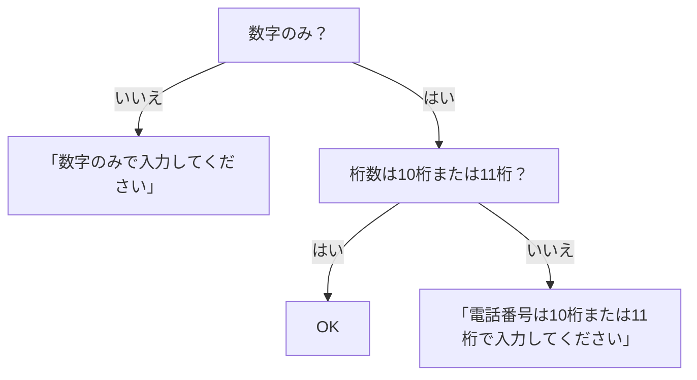
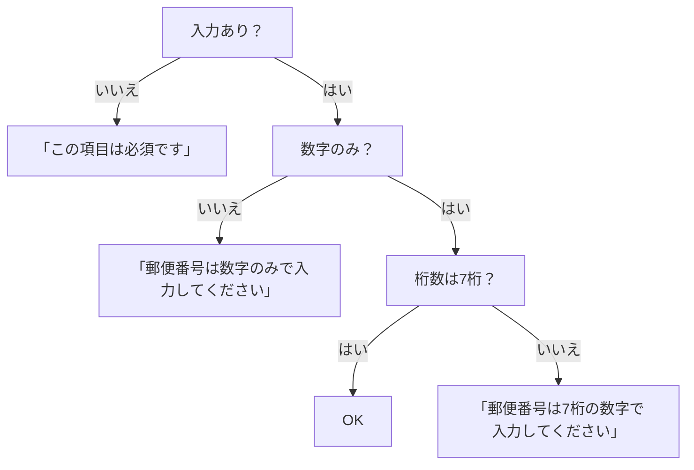

### 名前（Name）バリデーションフローチャート

```mermaid
flowchart TD
    A[入力あり？] -->|いいえ| B[「この項目は必須です」]
    A -->|はい| C[文字数は50文字以下？]
    C -->|はい| D[OK]
    C -->|いいえ| E[「50文字以内で入力してください」]
```
### メールアドレスのバリデーションフローチャート

```mermaid
flowchart TD
    A[入力あり？] -->|いいえ| B[「この項目は必須です」]
    A -->|はい| C[メール形式が正しい？]
    C -->|はい| D[OK]
    C -->|いいえ| E[「メールアドレスの形式が正しくありません」]
```
### パスワードのバリデーションフローチャート

```mermaid
flowchart TD
    A[入力あり？] -->|いいえ| B[「この項目は必須です」]
    A -->|はい| C[8文字以上？]
    C -->|いいえ| D[「8文字以上の英数字を含めてください」]
    C -->|はい| E[英字と数字を両方含む？]
    E -->|はい| F[OK]
    E -->|いいえ| G[「英字と数字を組み合わせて入力してください」]
```

### 電話番号のバリデーションフローチャート

```mermaid
flowchart TD
    A[数字のみ？] -->|いいえ| B[「数字のみで入力してください」]
    A -->|はい| C[桁数は10桁または11桁？]
    C -->|はい| D[OK]
    C -->|いいえ| E[「電話番号は10桁または11桁で入力してください」]
```

### 郵便番号のバリデーションフローチャート

```mermaid
flowchart TD
    A[入力あり？] -->|いいえ| B[「この項目は必須です」]
    A -->|はい| C[数字のみ？]
    C -->|いいえ| D[「郵便番号は数字のみで入力してください」]
    C -->|はい| E[桁数は7桁？]
    E -->|はい| F[OK]
    E -->|いいえ| G[「郵便番号は7桁の数字で入力してください」]
```

