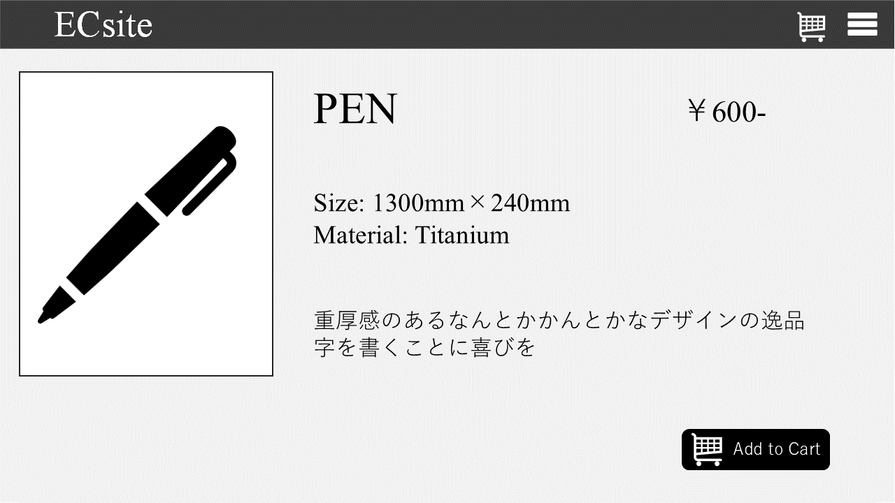
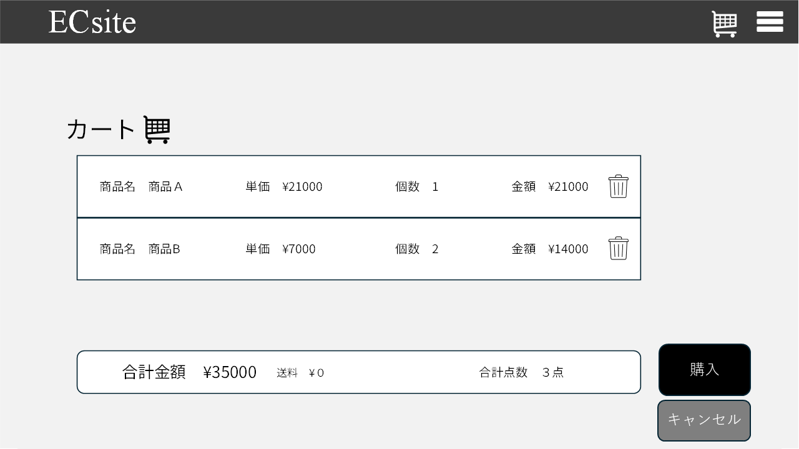
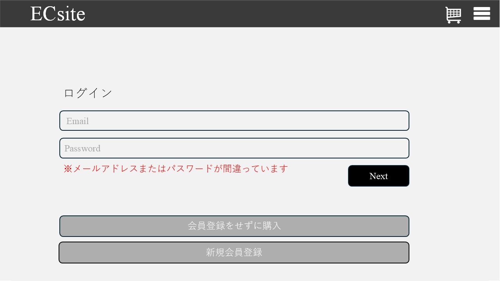
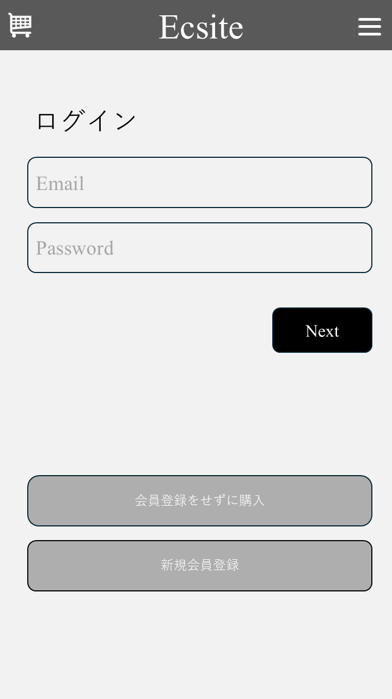
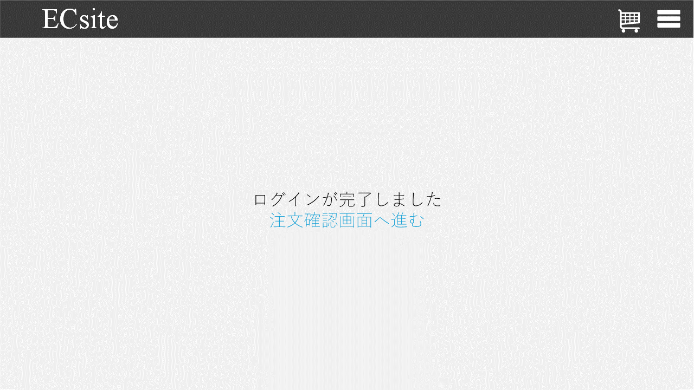
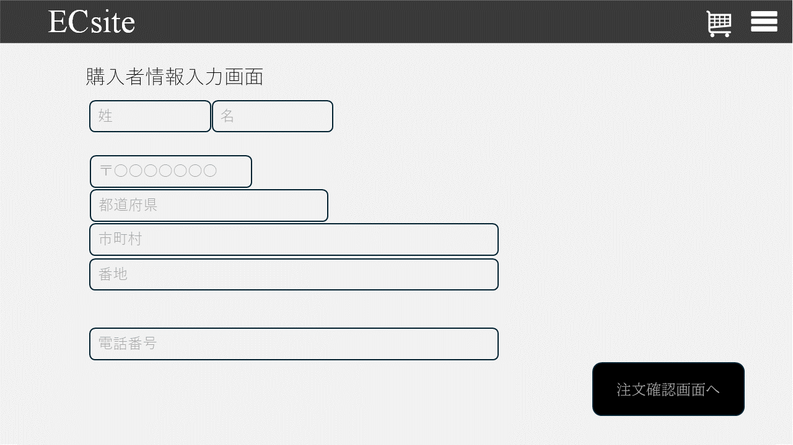
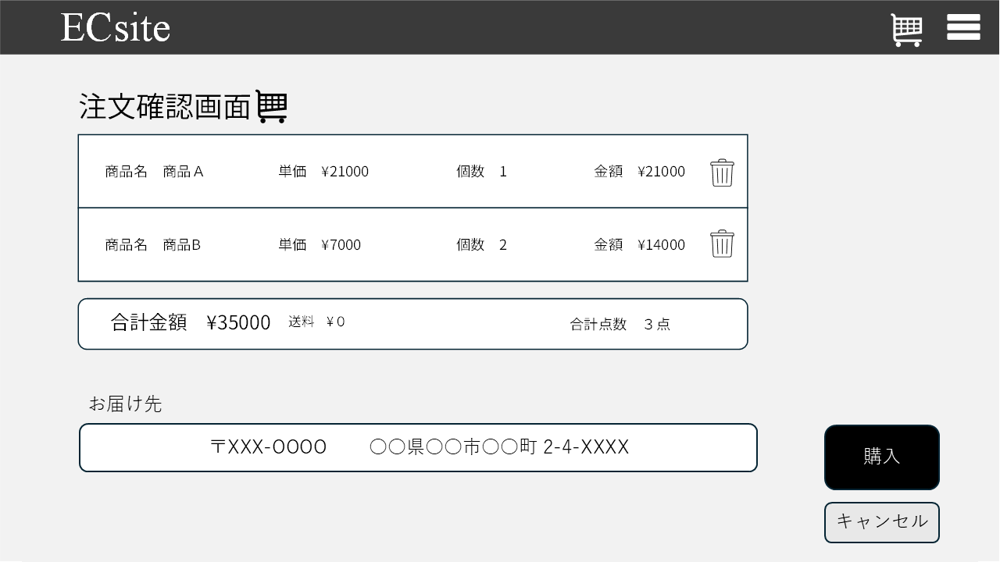

### 4.1 画面一覧
| 画面ID | 画面名       | 概要                              | 機能ID            | 備考          |
| ---- | --------- | ------------------------------- | --------------- | ----------- |
| S001 | 商品一覧画面    | 商品の一覧を表示し、詳細画面への遷移が可能           | 101/102/103     | トップページを兼ねる |
| S002 | 商品詳細画面    | 選択した商品の詳細情報を表示                  | 104/105/106/107 | カート追加ボタンあり  |
| S003 | カート画面     | カートに追加した商品の確認・数量変更が可能           | 201/202/203/204 | 商品削除・合計金額表示 |
| S004 | ログイン画面    | 購入時に会員ログイン情報の入力を行う画面            | 302             |             |
| S005 | ログイン完了画面  | ログイン完了後に遷移する画面                  | 302             |             |
| S006 | 購入者情報入力画面 | ログインをしないユーザーが注文のための購入者情報を入力する画面 | 205             | バリデーションあり   |
| S007 | 注文確認画面    | 入力内容及び注文内容の最終確認を行う画面            | 206             |             |
| S008 | 注文完了画面    | 注文完了メッセージを表示する画面                | 207             |             |
| S009 | 会員登録画面    | 会員情報の入力および登録を行う画面               | 301             |             |
| S010 | 会員登録完了画面  | 会員登録の完了メッセージを表示する画面             | 301             |             |

 
---

| No. | 対象画面ID    | 対象画面名     | 変更内容              | 備考               |
| --- | --------- | --------- | ----------------- | ---------------- |
| 1   | S004      | ログイン画面    | エラーメッセージの追加       | 入力バリデーション対応      |
| 2   | S006      | 購入者情報入力画面 | エラーメッセージの追加       | 既存バリデーションに対応強化   |
| 3   | S009      | 会員登録画面    | エラーメッセージの追加       | 入力必須項目の明確化       |
| 4   | S001〜S010 | 全体        | スマートフォン対応レイアウトを追加 | レスポンシブデザイン対応     |
| 5   | S007      | 注文確認画面    | キャンセル機能を追加        | 確認画面からのキャンセル操作対応 |

**S001　商品一覧画面**
PC

スマホ

**S002　商品詳細画面**
PC

スマホ

**S003　カート画面**
PC

スマホ

**S004　ログイン画面**
PC

スマホ

**S005　ログイン完了画面**

**S006　購入者情報入力画面**
PC

スマホ

**S007　注文確認画面**
PC

**S008　購入完了画面**
PC

スマホ

**S009　会員登録画面**
PC

スマホ

**S010登録完了画面**
PC

スマホ
